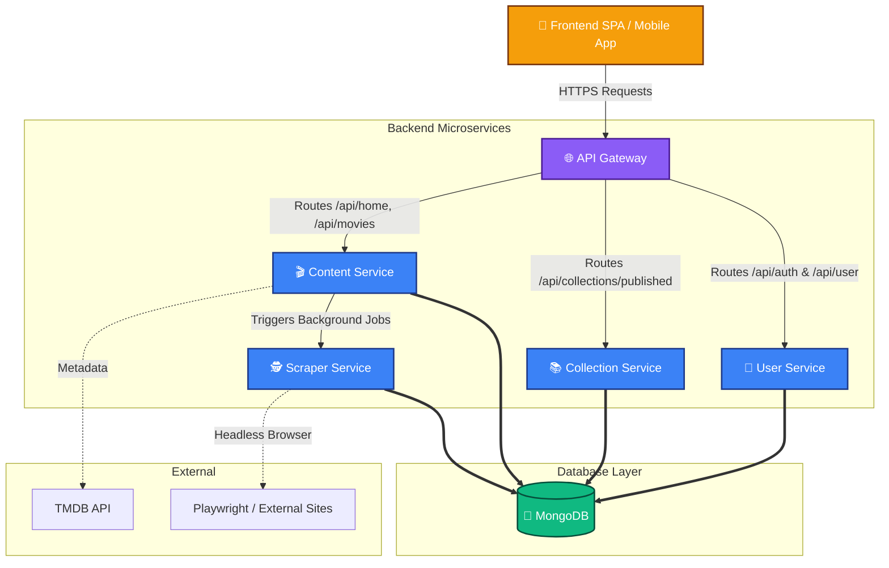

# 🎬 Soulstash


Soulstash is a high-performance, microservice-based movie and TV show streaming application. It features a beautiful React frontend and a highly scalable distributed Node.js backend architecture.

---

## 🏗️ Architecture Overview

Soulstash uses a robust microservices architecture to ensure maximum uptime, separation of concerns, and efficient data processing (like background web scraping). 



---

## 🚀 Key Technologies

- **Frontend:** React, Vite, Video.js, React Router
- **Backend:** Node.js, Express, TypeScript
- **Database:** MongoDB (Mongoose)
- **Scraping:** Microsoft Playwright (Headless Chromium)
- **Tooling:** Concurrently, TS-Node, dotenv

---

## 🔌 Service Endpoints

The architecture is split into 5 distinct backend services. All client traffic flows through the API Gateway, which securely routes requests to the internal microservices.

### 🌐 1. API Gateway (Port `3000`)
The central traffic director and reverse proxy for all frontend requests.
* **`GET /ping`** - Dashboard Status
* **`USE /api/*`** - Reverse proxies all traffic to the services below.

### 👤 2. User Service (Port `3001`)
Handles authentication, user profiles, and private collections.
* **`POST /register`** - Register a new account
* **`POST /login`** - Authenticate user and return JWT
* **`GET /me`** - Validate JWT and return user details
* **`GET /profile/:username`** - Fetch public user profile
* **`GET /collections`** - Fetch authenticated user's private collections
* **`POST /collections`** - Create a new custom collection

### 🎬 3. Content Service (Port `3002`)
Fetches and caches movie/TV data from TMDB and handles media streaming sources.
* **`GET /home`** - Aggregated homepage data (trending, genres, etc.)
* **`GET /trending`** - Paginated trending content
* **`GET /movies`** - Paginated movies by genre
* **`GET /search`** - Universal search across movies and TV
* **`GET /player/sources`** - Fetches available streaming video sources
* **`GET /tmdb-proxy`** - Secure pass-through to TMDB API

### 📚 4. Collection Service (Port `3003`)
Handles public-facing published collections.
* **`GET /published`** - Fetches all public collections for the community page

### 🕵️ 5. Scraper Service (Port `3004`)
Uses headless browsers to scrape background metadata (e.g., IMDb IDs and video links).
* **`POST /api/scrape`** - Triggers a Playwright headless scraping job
* **`GET /api/imdb/person/:id/filmography`** - Scrapes full filmography

---

## 💻 Local Development

Run the entire application stack locally with a single command:

```bash
# Starts all 5 microservices + the Vite frontend server
npm run dev
```

Run **only** the frontend (connecting to the live online Gateway):
```bash
# Starts Vite in live mode (uses spa/.env.live)
npm run dev:live
```

## 🌍 Production Deployment

Soulstash is optimized to run on distributed cloud platforms like **Render.com**. 
1. The **Frontend SPA** is hosted as a Static Site.
2. The **5 Backend Services** are hosted as individual Web Services.
3. Every service features a built-in UI dashboard at `/ping` to monitor its health and connectivity!
