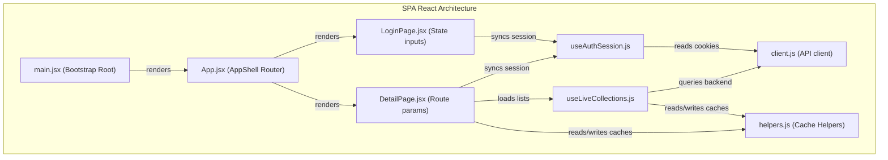

# Soulstash LLD Explorer Walkthrough

This document outlines the interactive Low-Level Design (LLD) explorer dashboards created to map the microservices architecture. These visualizers let you interactively drag components and trace execution call stacks bidirectionally (upstream callers in red, downstream callees in yellow) with detailed layman logic specifications.

---

## 🏗️ Mapped Microservices & Apps

### 1. User Service (`:3001`)
* **Interactive File**: [user_service_lld.html](file:///home/rakesh/Documents/Soulstash2/user_service_lld.html)
* **Design Patterns**: Encapsulates User Entity states, Authentication workflows, JWT signings, and password hashing algorithms.

### 2. Content Service (`:3002`)
* **Interactive File**: [content_service_lld.html](file:///home/rakesh/Documents/Soulstash2/content_service_lld.html)
* **Design Patterns**: 
  * **Decorator Pattern** (`CachingDecorator` wrapping `TMDBAdapter`) for 1-hour in-memory RAM caching.
  * **Adapter Pattern** (`TMDBAdapter` realizing `IContentProvider`) for external TMDB REST APIs integrations.
  * **Repository Pattern** (`ContentCacheRepository` and `MongoRatingsRepository`) for persistent database lookups.
  * **Utility libraries** (`legacyScores.ts` and `playerSourcesHelpers.ts`) for query relevance scoring and scraper payload mappings.

### 3. Collection Service (`:3003`)
* **Interactive File**: [collection_service_lld.html](file:///home/rakesh/Documents/Soulstash2/collection_service_lld.html)
* **Design Patterns**:
  * **Repository Pattern** (`MongoCollectionRepository`) compiling published playlists containing 7+ items using complex MongoDB aggregation pipelines (unwinding collections, filtering Watched lists, and verifying sizes).
  * **Express Routing** mapping active collection feeds endpoints.

### 4. Scraper Service (`:3004`)
* **Interactive File**: [scraper_service_lld.html](file:///home/rakesh/Documents/Soulstash2/scraper_service_lld.html)
* **Design Patterns**:
  * **Headless Browser Singleton Pattern** (`playwrightFetch` utility) warming and managing a single Chromium process using Playwright to handle resource-blocking (turning off images/fonts to increase speed) and stealth WebDriver settings to bypass automated detection.
  * **Cloudflare Clearance Polling**: Uses interval page validation loops inside page navigation to block execution until CF challenges resolve successfully.
  * **Scraper Pattern** (`imdbScraper` and `legacyPlayerSources`) loading biography filmographies and movie streaming options.

### 5. SPA React Frontend App
* **Interactive File**: [spa_react_lld.html](file:///home/rakesh/Documents/Soulstash2/spa_react_lld.html)
* **React Patterns Mapped**:
  * **Bootstrapping Render** (`main.jsx` mounting `App.jsx` in routing BrowserRouter DOM roots).
  * **Routing Maps**: Dynamically routes authentication gates, profile page layouts, and film profiles details (`/movie/:id`).
  * **Custom Hooks**:
    * `useAuthSession`: Checks browser cookie tokens and broadcasts updates to sync logins between browser tabs.
    * `useLiveCollections`: Pulls collections cache instantly and attaches custom event listeners `soulstash:collections-updated` to avoid screen flickers on mutations.
  * **State & Props (Parameters)**: Traces form submission states, parameters, and error displays inside components.

---

## 🎨 Shared Dashboard Interactive Features

Across all visualizer dashboards, you can use:
* **Interactive HUD Zoom Controls**: Zoom in, zoom out, or reset zoom offset settings.
* **Canvas Panning**: Click and drag empty grid canvas space to navigate massive diagrams.
* **Draggable UML Blocks**: Click and drag card headers to organize layouts. Connection lines stretch dynamically in real-time.
* **Clip-Free Paths**: Configured with `overflow: visible !important` to ensure path lines render cleanly outside original canvas limits.
* **State Persistence**: Uses browser `localStorage` to save card coordinates between reloads.
* **Layout Reset Button (🧹)**: Clears layout cache and restores the clean grid.
* **Bidirectional Splitting Animations**: Clicking a middle method separates tracing directions:
  * **Upstream call path (Red)**: Glydes backwards indicating what triggers the function.
  * **Downstream call path (Yellow)**: Glydes forwards indicating sub-methods called.
* **Layman Timeline Inspections**: Exposes detailed blocks explaining exactly **What** each function does, **How** it implements its steps, and **Why** it was built that way.
